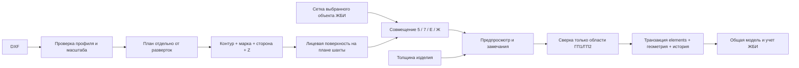

# Проектирование разработки

## Цель и границы

Добавить поштучный учет панелей облицовки лифтовых шахт ГП1/ГП2 внутри существующего объекта ЖБИ «Москвич»: распознать марку и контур, вычислить сторону/координаты/отметки, показать изделия на общей модели, применять обычные статусы и контрактацию сервиса.

Поддерживаемое семейство — проверенный DXF с восьмью развертками сторон, отдельным планом и осями 5/7/Е/Ж. Первая версия сознательно имеет **явный профиль**, а не обещает распознать произвольный CAD-файл. Изменение верстки, наклонные/дуговые контуры, другая сетка или конструкции шахты требуют нового профиля. Неизвестный вариант возвращает понятную ошибку; неполный список панелей не импортируется.

## Поток данных

Распознавание и размещение — чистые функции без БД. БД используется отдельно для чтения целевой сетки и для двухфазного импорта. Поэтому эти же функции вызываются CLI, API и тестами.

## Модель данных

Общий учет остается в `elements`, а не переносится в `revit_elements`. Новый `element_type`: **Панель облицовки шахты**. `mark` — ПП7, ПП11.1н и т. п.; это 30 типоразмеров, не 30 новых категорий объекта.

| Поле/таблица | Назначение |
|---|---|
| `elements.height_mm` | Реальная вертикальная высота каждого изделия |
| `elements.outline_json` | Горизонтальный след панели после задания толщины |
| `elements.elevation_mm` | Низ панели в системе высот объекта |
| `elements.x/y/z` | Центр следа в плане и отметка низа |
| `elements.mark_id` | Ссылка на марку в объектном справочнике |
| `elements.element_uid` | Стабильный UUID строки учета |
| `shaft_panel_geometry` | Принадлежность области импорта, физический ключ, исходный файл/хэш, DXF handles и точная геометрия |
| `shaft_panel_imports` | Транзакционный журнал применений: объект, пользователь, файл, сводка |

`subtype` и `floor` не заполняются стороной или «остановкой»: в существующем сервисе у этих полей другая семантика. Сторона и шахта хранятся в metadata и отображаются в адресе и слое.

Миграция добавляет поле и две таблицы, ничего не удаляет. `install_schema` идемпотентна, не делает commit. Ее подключают к штатному механизму миграций, а не запускают при каждом анализе файла.

## Идентичность и обновления

Ключ физической позиции — `shaft + face + U_min/U_max + Z_min/Z_max` с округлением до 0,1 мм. Он **не содержит марку, имя файла и DXF handle**. Поэтому одинаковая геометрия после переименования файла или пересоздания handles сохраняет существующее изделие, статус и историю. Номер позиции не назначается сортировкой: вставка одной панели не перенумеровывает остальные.

Если реально изменились габариты или локальная позиция, результат — «новая» + «отсутствующая». Автоматически переносить историю между этими позициями пакет не пытается. Для таких редакций следующий этап — явный диалог «это та же панель», с one-to-one переназначением ключа и аудитом. Пока пользователь сохраняет отсутствующую панель актуальной или отдельно подтверждает снятие актуальности; массовая очистка не выполняется по умолчанию.

Меняются только поля геометрии. `current_status`, контракты, даты, история, `element_uid` прежних изделий не обнуляются. Изменение марки законтрактованного изделия и конфликт с ручными правками блокируются; корректировка должна пройти через действующий редактор/contract_guard. Прямое удаление контрактной ссылки для обхода конфликта не предусмотрено.

## Дополнительный чертеж в существующем объекте

Текущий `element_sync.analyze_import` сравнивает новые строки со всеми актуальными элементами объекта; `_register_drawing` снимает актуальность остальных чертежей. Для дополняющей развертки эти предположения неверны.

Пакет использует независимую область `(object_id, scope='gp1-gp2')`, отдельный текущий источник с понятным названием и отдельную сверку. Не вызывает `element_sync.apply_import` или `_register_drawing` для разверток.

**Обязательное встречное изменение:** штатный импорт ЖБИ исключает строки `shaft_panel_geometry` из сверки и сохраняет дополнительный чертеж актуальным. Готовые функции лежат в `integration/protect_standard_import.py`. Без их подключения нельзя выпускать фичу: первая обычная перезагрузка главного DXF снимет панели с модели.

Выбор объекта на схеме должен раскрывать **все** его текущие чертежи. Явный выбор исторического файла сохраняет прежнее поведение. Нельзя просто добавлять панели ко всем запросам `/plan-data`: это обойдет пользовательские фильтры слоев и явный просмотр истории.

## Геометрия 2D/3D

Панели прямоугольные. Отдельный новый Three.js-движок не нужен: после задания толщины горизонтальный контур экструдируется от `elevation_mm` на `height_mm`. Ветку `panelExtrusionHeight` подключить раньше общего fallback «высота = ширина сечения». Иначе высокая панель будет нарисована толщиной в 60/100 мм по вертикали.

Существующая конверсия мировых координат `(x, z, -y)` сохраняется. Буферы, выделение, raycast, ID изделия, фильтры, цвета статусов и запросный рендер остаются штатными. Подписи нового типа нужно рисовать на вертикальных гранях по направлению стороны, проверив их читаемость из шахты.

В офлайн-отчете показаны лицевые поверхности. Нельзя воспринимать полупрозрачные SVG-полигоны как проверку массы, стыковки закладных или конструктивной толщины. План определяет грань; толщину изделия нужно получить из спецификации/паспорта. Для первой версии форма принимает общую толщину подтвержденного комплекта. Разные толщины по маркам — отдельное расширение схемы параметров, UI и тестов, без изменения parser.

## API и конкурентность

- `POST /shaft-panels/analyze`: multipart DXF, `object_id`, необязательные `thickness_mm`, `grid_source`. При отсутствии толщины выдает поверхности и замечания; commit заблокирован.
- `POST /shaft-panels/apply`: непрозрачный токен, подтвержденные коды замечаний, явный `retire_missing` (по умолчанию false). Объект и геометрия берутся с сервера, не из тела применения.
- `DELETE /shaft-panels/pending/{token}`: отмена предпросмотра своего пользователя.

Обе стадии проверяют `drawings/write` для объекта. До чтения DXF проверяется доступ; до записи снимается штатная резервная копия. Analyze не меняет БД. Apply использует `BEGIN IMMEDIATE`, заново проверяет снимок строк и сетку, выполняет записи и hooks в одной транзакции. При исключении откатываются панели, марки, история, реестр чертежей и внутренний журнал.

Срок токена 15 минут, максимум 8 результатов в памяти процесса, владелец зафиксирован. Успешный токен потребляется один раз. Текущий Docker запускает один uvicorn worker, что соответствует реализации. При переходе к нескольким worker/репликам заменить store на общий SQLite/Redis с атомарным consume; не увеличивать workers без этого изменения.

Функции hooks не имеют права делать commit или открывать второго SQLite-писателя. Штатный `activity.log` использует очередь: если нужна запись в общий журнал, вызывать ее после успешного commit либо реализовать outbox. Внутренний `shaft_panel_imports` уже атомарен с элементами.

## Этапы внедрения и критерии завершения

| Этап | Работа | Проверка завершения |
|---|---|---|
| 1 | Воспроизвести 184 панели; подтвердить толщину изделия и трактовку −0,800 | Ведомость сверена, 23 внешние марки доступны в предпросмотре |
| 2 | Перенести пакет, миграция, ACL, backup, scoped import | API тесты проходят; другие 14 349 элементов не меняются |
| 3 | Защитить обычный импорт и поддержку нескольких текущих чертежей | Цикл «главный DXF → панели → главный DXF» сохраняет оба набора |
| 4 | Подключить форму, справочник типа, высоту, подписи, зоны | Панели видны в общей 2D/3D-модели; выбираются отдельно |
| 5 | Учёт и приемка | Статус/контракт/даты/марки/экспорт, повторный импорт, конфликтная редакция |
| 6 | Документация и выпуск | Штатный dry-run миграций, бэкап, релиз по принятой процедуре |

Основные оставшиеся интеграционные риски: скрытые предположения «один текущий DXF», жесткие перечни типов в отдельных UI-функциях, обрезание `height_mm` Pydantic-моделями, схема зон «лесенкой» с одним ярусом, общий журнал действий и управление конфликтами редакций. Точные точки и инструкции — в `CLAUDE_CODE.md`.
